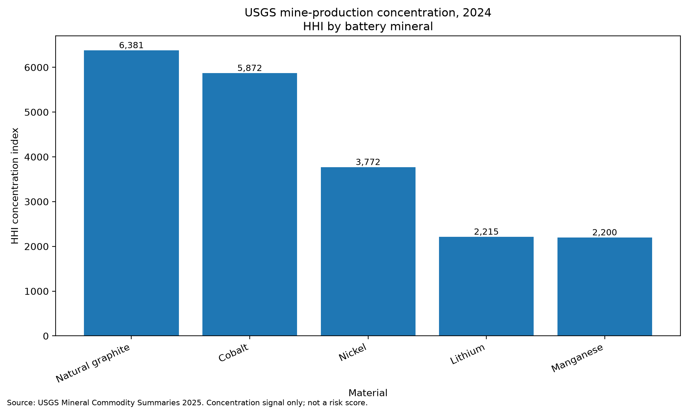
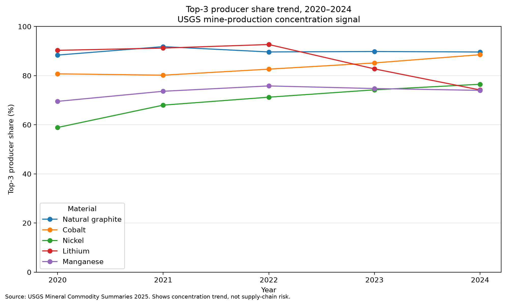
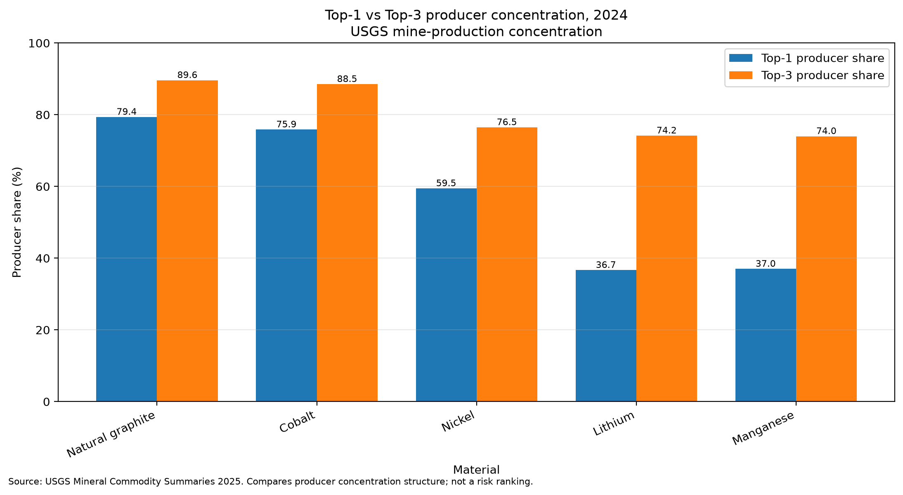

# Battery Market Strategic Exposure

## Project Overview

This project analyzes supply concentration patterns in selected battery-related critical minerals using a USGS-only mine-production dataset.

The goal is to convert raw production data into structured concentration metrics for a focused analytical question: which battery minerals show the highest observed mine-production concentration, and whether concentration has improved or worsened over time.

The project is designed as a reproducible concentration-analysis project, not as a geopolitical model, investment recommendation, or forecast.

## V2.1 — Critical Minerals Mine-Production Concentration Tracker

V2.1 is a USGS-only critical minerals mine-production concentration tracker covering lithium, cobalt, nickel, natural graphite, and manganese from 2020 to 2024.

The pipeline uses curated mine-production inputs, calculates producer-level country shares, derives concentration metrics, ranks the latest year, and generates visual outputs for project documentation.

V2.1 focuses on observed production concentration. It does not convert concentration into a risk score.

Detailed case study:

    docs/v2_1_mine_production_concentration_case_study.md

## Business Question

Which battery minerals show the highest and most persistent observed mine-production concentration, and has concentration improved or worsened over time?

## What V2.1 Measures

V2.1 measures country-level mine-production concentration for selected battery minerals.

The core signal is based on:

- producer share by country
- largest producer share
- top-three producer share
- Herfindahl-Hirschman Index, or HHI
- share coverage validation

The latest 2024 ranking shows natural graphite and cobalt with the highest observed mine-production concentration among the selected minerals, followed by nickel, lithium, and manganese.

## Key 2024 Output

| Rank | Material | Top Producer | Top 3 Share (%) | HHI |
|---:|---|---|---:|---:|
| 1 | Natural graphite | China | 89.625 | 6380.866 |
| 2 | Cobalt | Congo (Kinshasa) | 88.517 | 5871.850 |
| 3 | Nickel | Indonesia | 76.486 | 3771.872 |
| 4 | Lithium | Australia | 74.167 | 2215.265 |
| 5 | Manganese | South Africa | 74.000 | 2200.027 |

## Visual Outputs

The README highlights three main charts:

1. 2024 HHI ranking by material
2. Top-three producer share trend over time
3. 2024 comparison of largest-producer share and top-three share

A separate share coverage diagnostic chart is generated as a method and audit output, but is not used as a main README visual.

### 2024 HHI Ranking

### Top 3 Producer Share Trend

### 2024 Top 1 vs. Top 3 Producer Share Comparison

## Methodology

The V2.1 pipeline starts from a curated USGS-only mine-production input file. For each material, year, and producing country, producer share measures that country's share of reported mine production. Top-1 producer share identifies the share held by the largest producer in a given material-year. Top-3 producer share sums the production shares of the three largest producers and is used to show how concentrated production is among the leading suppliers.

HHI, or Herfindahl-Hirschman Index, squares and sums producer shares to capture overall concentration across the producer base. A higher HHI indicates more concentrated observed mine production. The pipeline also includes a share coverage check to confirm that calculated country shares for each material-year align with USGS World totals before the concentration outputs are used.

## How to Run V2.1

Run the concentration calculation:

    python src/calculate_critical_minerals_concentration.py

Generate the charts:

    python src/create_critical_minerals_charts.py

Expected result:

- processed concentration datasets are written to data/processed/
- chart outputs are written to outputs/charts/
- the chart pipeline completes using the matplotlib Agg backend

## Generated Outputs

### Curated Input

    data/curated/critical_minerals_production_inputs.csv

### Source Scripts

    src/calculate_critical_minerals_concentration.py
    src/create_critical_minerals_charts.py

### Processed Data

    data/processed/critical_minerals_country_shares.csv
    data/processed/critical_minerals_concentration_metrics.csv
    data/processed/critical_minerals_latest_ranking.csv

### Charts

    outputs/charts/critical_minerals_2024_hhi_ranking.png
    outputs/charts/critical_minerals_top3_share_trend.png
    outputs/charts/critical_minerals_2024_top1_top3_comparison.png
    outputs/charts/critical_minerals_share_coverage_diagnostic.png

The share coverage diagnostic chart is retained as a method and audit output rather than as a main README visual.

## Limitations

This project measures observed USGS mine-production concentration only. It is not a risk score, not an investment signal, not a geopolitical ranking, and not a forecast.

The results show where mine production is concentrated by country, but they do not independently measure trade flows, refining capacity, reserves, substitution potential, inventory buffers, company exposure, political stability, pricing power, or downstream battery supply-chain resilience.

Concentration is therefore treated as a decision-relevant supply-structure signal, not as a complete measure of mineral supply risk.

## Version Note

V2.1 establishes the mine-production concentration baseline for this project.

Earlier V1 framing is retained only as project history and has been superseded by the V2.1 USGS-only mine-production concentration tracker and the V2.2 processing/refining concentration snapshot.

---

## V2.2 — Processing & Refining Concentration Snapshot

V2.2 extends the V2.1 mine-production concentration analysis into a limited downstream concentration comparison.

### Business question

Which battery minerals remain most concentrated after mine production, and does processing/refining concentration create a stronger bottleneck than mining concentration?

### Scope

This module compares 2024 mine-production top-three concentration from the V2.1 dataset with public-source processing/refining top-three concentration evidence.

Included minerals:

- lithium
- cobalt
- nickel
- natural graphite
- manganese

### Key output

The V2.2 snapshot shows that, under the allowed 2024 top-three-share comparison, all five minerals have higher processing/refining concentration than mine-production concentration.

| Mineral | Mining top-3 share | Processing/refining top-3 share | Higher bottleneck stage |
|---|---:|---:|---|
| lithium | 74.17% | 96.00% | processing/refining |
| cobalt | 88.52% | 89.00% | processing/refining |
| nickel | 76.49% | 78.00% | processing/refining |
| natural graphite | 89.62% | 99.00% | processing/refining |
| manganese | 74.00% | 95.00% | processing/refining |

### Files

- `src/calculate_processing_refining_snapshot.py`
- `data/processed/critical_minerals_processing_refining_snapshot.csv`
- `outputs/briefs/processing_refining_concentration_snapshot_brief.md`

### Claim boundary

V2.2 is a concentration signal only.

It is not:

- a risk score
- an investment signal
- a geopolitical ranking
- a forecast
- a policy recommendation
- a full 2020–2024 annual refining tracker

### Source limitations

The processing/refining side uses public-source snapshot evidence rather than a complete annual country-level refinery dataset.

Important limitations:

- refining HHI is not calculated
- refining top-one share is not calculated
- manganese uses battery-grade manganese sulphate proxy evidence
- processing/refining product definitions may not exactly match USGS mine-production categories
- country-level concentration is not the same as company-level control

